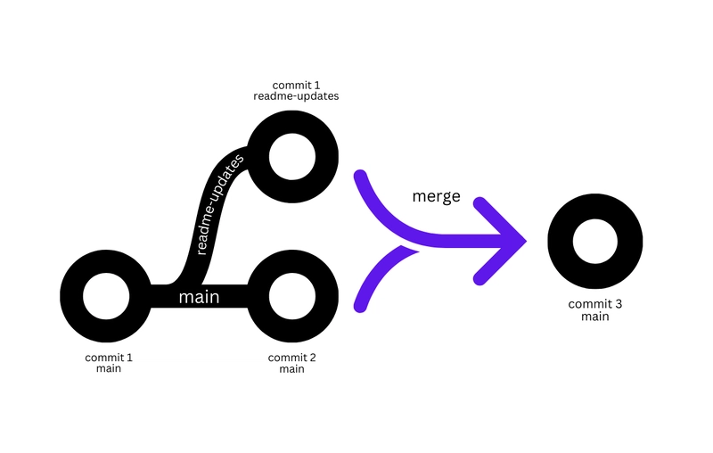

# Ramas_Github
Github define una rama como forma de aislar el desarrollo de funcionalidades, correciones o esperimentos  sin modificar directamente las demas ramas. una rama normalmente se crea a partir de otra y luego puede integrase mediante un  *pull request*.Una rama es una version independiente de un proyecto que permite trabajar en cambios sin modificar el anterior.

# Trabajo_con-ramas
cuando se trabaja con un proyecto utilizando GitHub, las ramas son herramientas muy importantes porque perminten que varias personas puedan trabajar al mismo tiempo sin afectar directamente el codigo principal.
una rama se puede entender como una copia del proyecto en la que podemos hacer cambios,agregar nuevas,funciones o corregir errores. por ejemplo si estamos creando una pagina web y se necesita agregar o quitar alguna sistema de inicio de sesion, podemos craer podemos crear una rama llamada *Longi* y trabajar ahi. de esta manera, si comentemos errores o dañamos el proyecto principal.

GitHub describe un flujo de trabajo en el que se crea una rama, se realizan cambios y commits, se abre un Pull Request para revisar los cambios y finalmente se hace el merge.
Además, GitHub permite proteger ramas importantes, por ejemplo exigiendo revisiones de Pull Requests, comprobaciones automáticas, resolución de conversaciones o historial lineal antes de permitir un merge.

# Flujo de trabajo recomenado.
*crear una rama*
Inicia siempre una nueva rama desde main actualizada para cada tarea específica o error que vayas a resolver
*Hacer cambios*
 Edita, añade o borra archivos en tu entorno local y guarda los cambios usando git add y git commit.
 *Publicar la rama*
 Sube tu trabajo al repositorios remoto con git pus 
 *Abrir un pull request*
  En GitHub, solicita la unión (merge) de tu rama con la principal para que otros revisen el código antes de integrarlo.

# descripcion general de las ramas
Las ramas de Git son una característica esencial del sistema de control de versiones Git. Permiten a los desarrolladores trabajar en diferentes versiones de un proyecto simultáneamente sin afectar la rama principal. Además, las ramas permiten que varios desarrolladores trabajen en el mismo proyecto sin interferir entre sí. Al crear una rama para cada tarea o funcionalidad, los desarrolladores pueden trabajar de forma independiente e integrar sus cambios en la rama principal cuando estén listos. Las ramas también facilitan el seguimiento de los cambios y la posibilidad de revertir a versiones anteriores del código si fuera necesario.

